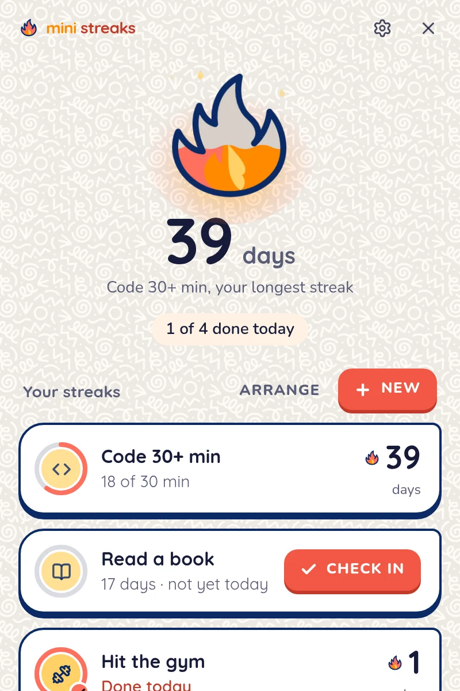
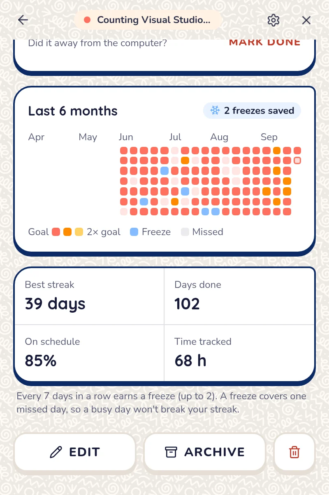
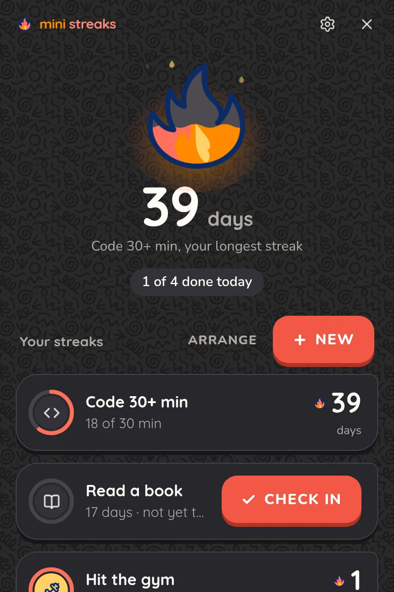

Mini Streaks is a small desktop app for keeping daily habits going. You tell it what you want to do each day and which apps that happens in, and it quietly counts the minutes in the background. Hit your goal and the streak grows. For habits that don't happen at a computer, like the gym or reading, you check them off yourself.

It runs on Windows, macOS and Linux, and everything stays on your machine.

<p align="center">
  
  &nbsp;
  
  &nbsp;
  
</p>

## Features

- Automatic tracking. Pick apps, or a word in the window title (handy for websites), and set a daily goal in minutes. Time only counts while one of them is focused, and it stops when you step away from the keyboard.
- Manual check-ins for everything else, with undo.
- A flame that fills up as you work towards today's goal, and grows as the streak gets longer.
- Rest days that don't break your streak, plus freezes: every 7 days in a row earns one (you can hold two), and a freeze covers a day you miss.
- Six months of history, your best streak, how often you stay on schedule and total time tracked.
- A notification when you reach a goal, and an evening reminder if a streak still needs today.
- A tray menu for checking progress, checking in and pausing tracking without opening the window.
- Backups you can export and import from Settings.

## Download

Grab the latest version from the [releases page](https://github.com/Kim-Tsok/mini-streaks-app/releases/latest).

| System | File |
|---|---|
| Windows 10 or 11 | `.exe` installer (or `.msi`) |
| Mac with Apple silicon | `aarch64.dmg` |
| Mac with Intel | `x64.dmg` |
| Linux | `.AppImage`, `.deb` or `.rpm` |

The builds aren't code-signed yet, so the first launch needs one extra click:

- **Windows:** on "Windows protected your PC", choose *More info*, then *Run anyway*.
- **macOS:** right-click the app and choose *Open*. If you want to track specific websites or window titles, allow Screen Recording when macOS asks. Tracking by app works without it.

## Tracking on Linux

On most setups tracking works straight away. GNOME on Wayland is the exception, because GNOME doesn't let apps see which window is focused. For that case Mini Streaks ships a small GNOME Shell extension and offers to install it on first launch. The extension shares only the focused app's name and window title, and only with apps running on your computer. After installing it, log out and back in once.

| Desktop | Tracking | Pauses when you're away |
|---|---|---|
| GNOME on Wayland | With the helper extension | Yes |
| X11 (any desktop) | Yes | Yes |
| KDE Plasma, Hyprland on Wayland | Yes | No, minutes count while the app is focused |
| Windows, macOS | Yes | Yes |

If tracking doesn't seem to pick anything up, run `cargo run --example probe` in `src-tauri/` to print exactly what the app can see.

## Privacy

Mini Streaks has no account, no server and no analytics. Your streaks live in a SQLite database in your user data folder. The only thing it reads from your system is which app is focused, its window title, and how long it's been since you last touched the keyboard or mouse. Window titles are used for matching and are never saved.

## Building from source

You'll need [Node.js](https://nodejs.org) 22, [pnpm](https://pnpm.io) and [Rust](https://rustup.rs), plus the [Tauri system dependencies](https://tauri.app/start/prerequisites/) for your OS.

```sh
pnpm install
pnpm tauri dev      # run the app
pnpm tauri build    # build installers for this machine
```

A few other useful commands:

```sh
pnpm dev                          # the UI alone in a browser, with sample data
cd src-tauri && cargo test        # streak logic, database migrations, app matching
```

`pnpm dev` runs against a mock backend (`src/lib/mock.ts`), so you can work on the interface without building the Rust side.

## Releasing

Installers for every platform are built by GitHub Actions (`.github/workflows/build.yml`). To make a release:

1. Bump `version` in `src-tauri/tauri.conf.json` and commit.
2. Tag the commit and push the tag:
   ```sh
   git tag v0.2.0
   git push origin v0.2.0
   ```
3. When the build finishes, a draft release appears with all the installers attached. Add the notes and publish it.

You can also start a build by hand from the Actions tab.

## Project layout

```
src/                     React interface
  components/            screens and UI pieces (Flame.tsx draws the mascot)
  lib/                   API wrapper, types, browser mock
src-tauri/
  src/stats.rs           streak, freeze and history calculations
  src/db.rs              SQLite storage and migrations
  src/tracker.rs         background loop that counts time
  src/activity/          focus and idle detection per platform
  src/apps.rs            app list for the picker, matching rules
  src/tray.rs            tray menu
  gnome-extension/       the GNOME helper extension
```

Streak numbers are always calculated from the daily history rather than stored, so they can't drift out of sync.
